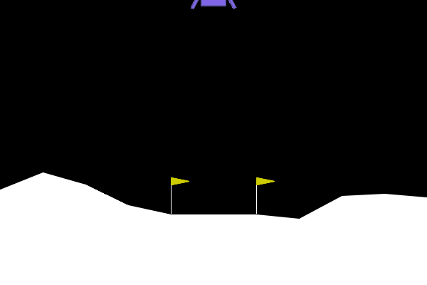

# Lunar_Landing_BO
Application of Bayesian Optimization into a Lunar Landing Bot

Bayesian Optimization is an algorithm that searches for a blackbox function's maxima/minima by updating the model's belief after each time receiving a new input & output data. The core of BO belief-updating is a Gaussian Process. After updating, an acquisition function chooses a new point $x$ to explore $f(x)$ based on the new belief. (in this project, I use UCB).

In this project, I explore an educational application of BO in Lunar Landing game, where we expect the algorithm to learn the set of parameters for the Spaceship's engine that maximizes the score. 

This essentially means learning the velocity, angle... so that the spaceship lands successfully on the target.

It works like a "curious learner". At each iteration, the model chooses to explore a new set of params, which can be a good configuration, or even make the ship crash miserably. 

However, learning about the result of the previously chosen parameter reduces the model's uncertainty about the environment, hoping to find better parameters.

(check out https://arxiv.org/abs/1807.02811 for more mathematical details of BO)

